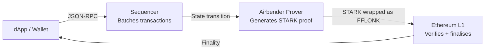

# ADI Chain Internals

What makes ADI Chain different from a standard EVM chain, and what that means for dApp developers.

---

## Architecture overview

ADI Chain is a ZK rollup L2 secured by Ethereum, built on the **Airbender** proving system.

Developers write standard Solidity and interact via standard ethers.js / wagmi / viem.  
**No ZK circuits, no proof SDK, no extra configuration.** ZK security is automatic.

---

## EVM compatibility

ADI Chain supports all standard EVM opcodes and precompiles. OpenZeppelin contracts work without modification. Standard deployers (`CREATE`, `CREATE2`) work.

What does NOT work:

| Feature | Status | Notes |
|---|---|---|
| Type-113 transactions (ZKSync native AA) | Rejected by chain | Use EIP-1559 (type 2) |
| `customData` field on transactions | Ignored / rejected | Use plain transactions |
| `zksync-ethers` in browser | Broken | CDN bundle is Node.js-only |
| `eth_getBlockByTag("pending")` | Not supported | Do not use Hardhat Ignition directly |
| `zks_*` RPC methods | Not implemented | Including `zks_getBaseTokenL1Address` |

---

## Account Abstraction status

ADI Chain OS (Airbender) has an `AA_ENABLED` bootloader flag for native account abstraction. It is currently **disabled on the live deployment**.

What this means:

- Paymaster contracts (`ADIPaymaster.sol`) **can be deployed and funded** on ADI Chain
- The bootloader **does not invoke them** - transactions proceed as plain EIP-1559
- ERC-4337 EntryPoint contracts are deployed at the standard addresses but are not enforced by the chain
- There is no native paymaster flow today

When `AA_ENABLED=true` ships from ADI Foundation, the `GaslessPaymaster.sol` reference in `examples/gasless-voting-dapp` and the `ADIPaymaster.sol` template in `@adi-devtools/contracts` will work as intended.

### ERC-4337 entry point addresses

These are deployed on ADI Chain today (for reference):

| Contract | Address |
|---|---|
| ERC-4337 EntryPoint v0.7 | See `ENTRYPOINT_V07_ADDRESS` in `@adi-devtools/contracts/system` |
| ERC-4337 EntryPoint v0.8 | See `ENTRYPOINT_V08_ADDRESS` in `@adi-devtools/contracts/system` |

---

## System contracts

ADI Chain inherits a ZKSync-style system contract layout. Most are bootloader-internal - they cannot be invoked via `eth_call` from outside the chain.

| Contract | Address export | Callable externally? |
|---|---|---|
| Base Token (ADI) | `BASE_TOKEN_ADDRESS` | Yes - `withdraw`, `withdrawWithMessage` only; `balanceOf(uint256)` not `balanceOf(address)` |
| Nonce Holder | `NONCE_HOLDER_ADDRESS` | Yes - for custom smart account nonce management |
| System Context | `SYSTEM_CONTEXT_ADDRESS` | No - returns `0x` via `eth_call` |
| L1 Messenger | `L1_MESSENGER_ADDRESS` | Yes - `sendToL1` for L2-to-L1 messages |
| Contract Deployer | `CONTRACT_DEPLOYER_ADDRESS` | Yes - `getNewAddressCreate2`, `getAccountInfo` |

All addresses and ABIs are exported from `@adi-devtools/contracts/system`. See [[Contracts Reference]] for usage details.

---

## Gas model

ADI Chain uses the native ADI token for gas. The gas model is standard EIP-1559:

- `baseFeePerGas` fluctuates with network load
- `maxFeePerGas` and `maxPriorityFeePerGas` are supported
- Gas estimation via `provider.estimateGas()` works correctly

ADI Foundation operates the sequencer and prover. There are no external node providers and none are planned.

---

## L1 finalisation

Transactions reach L1 finality when the batch containing them is proved and verified on Ethereum. The proving time depends on prover throughput operated by ADI Foundation. For dApp development, standard `tx.wait()` and `receipt.blockNumber` are sufficient - you do not need to wait for L1 finality for normal use cases.

---

## Windows development

The ADI local node (`docker/`) is Linux-only. Windows developers use the public RPC endpoints directly:

- Testnet: `https://rpc.ab.testnet.adifoundation.ai`
- Mainnet: `https://rpc.adifoundation.ai`

No local node required. All six examples work on Windows with MetaMask and the public RPC.
