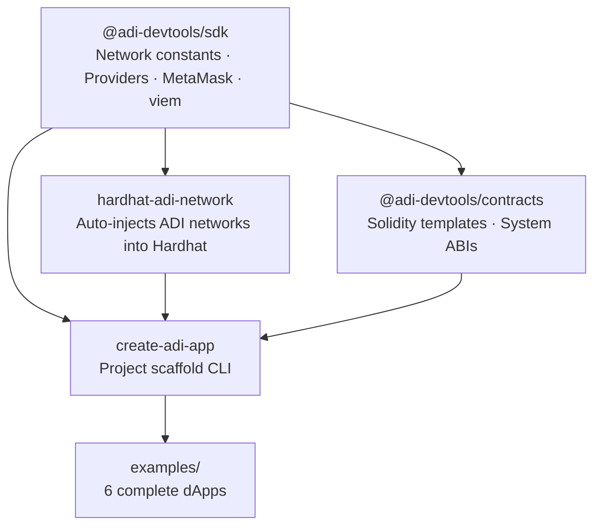

# ADI Dev Tools

> The missing developer ecosystem for [ADI Chain](https://docs.adi.foundation) - a ZK rollup L2 secured by Ethereum.

ADI Chain is fully EVM-compatible. Every standard Solidity contract, ethers.js script, and Hardhat/Foundry workflow works without modification. This monorepo fills the gap between "EVM-compatible" and "actually easy to build on".

---

## Packages

| Package | Install | What it does |
|---|---|---|
| [`@adi-devtools/sdk`](https://npmjs.com/package/@adi-devtools/sdk) | `npm i @adi-devtools/sdk` | Network constants, ethers.js providers, MetaMask helpers, viem chain definitions |
| [`hardhat-adi-network`](https://npmjs.com/package/hardhat-adi-network) | `npm i hardhat-adi-network` | Hardhat plugin - auto-injects ADI testnet + mainnet network configs |
| [`@adi-devtools/contracts`](https://npmjs.com/package/@adi-devtools/contracts) | `npm i @adi-devtools/contracts` | Solidity templates + typed ABIs for all ADI system contracts |
| [`create-adi-app`](https://npmjs.com/package/create-adi-app) | `npx create-adi-app my-dapp` | One-command project scaffold (Hardhat or Foundry + HTML frontend) |

---

## Package architecture

---

## Jump in

| I want to... | Go to |
|---|---|
| Start a project from scratch | [[Getting Started]] |
| Get chain IDs, RPCs, explorer URLs | [[Network Reference]] |
| Use the JS/TS SDK | [[SDK Reference]] |
| Configure Hardhat for ADI | [[Hardhat Plugin]] |
| Use a Solidity template | [[Contracts Reference]] |
| See a working dApp | [[Examples]] |
| Fix an error | [[Troubleshooting]] |
| Understand how ADI Chain works | [[ADI Chain Internals]] |
| Contribute to this repo | [[Contributing]] |

---

## Status

All planned tooling is complete and published. ADI Chain mainnet launched March 2026.

| Package / example | Status |
|---|---|
| `@adi-devtools/sdk` | ✅ Published |
| `hardhat-adi-network` | ✅ Published |
| `@adi-devtools/contracts` v0.1.3 | ✅ Published |
| `create-adi-app` v0.1.17 | ✅ Published |
| `examples/counter-dapp` | ✅ Live on testnet |
| `examples/voting-dapp` | ✅ Live on testnet |
| `examples/gasless-voting-dapp` | ✅ Live on testnet |
| `examples/nft-mint` | ✅ Live on testnet |
| `examples/simple-dao` | ✅ Live on testnet |
| `examples/token-faucet` | ✅ Live on testnet |
| Native AA / Paymaster support | ⏳ Future - `AA_ENABLED` not yet active on ADI Chain OS |

---

## Links

